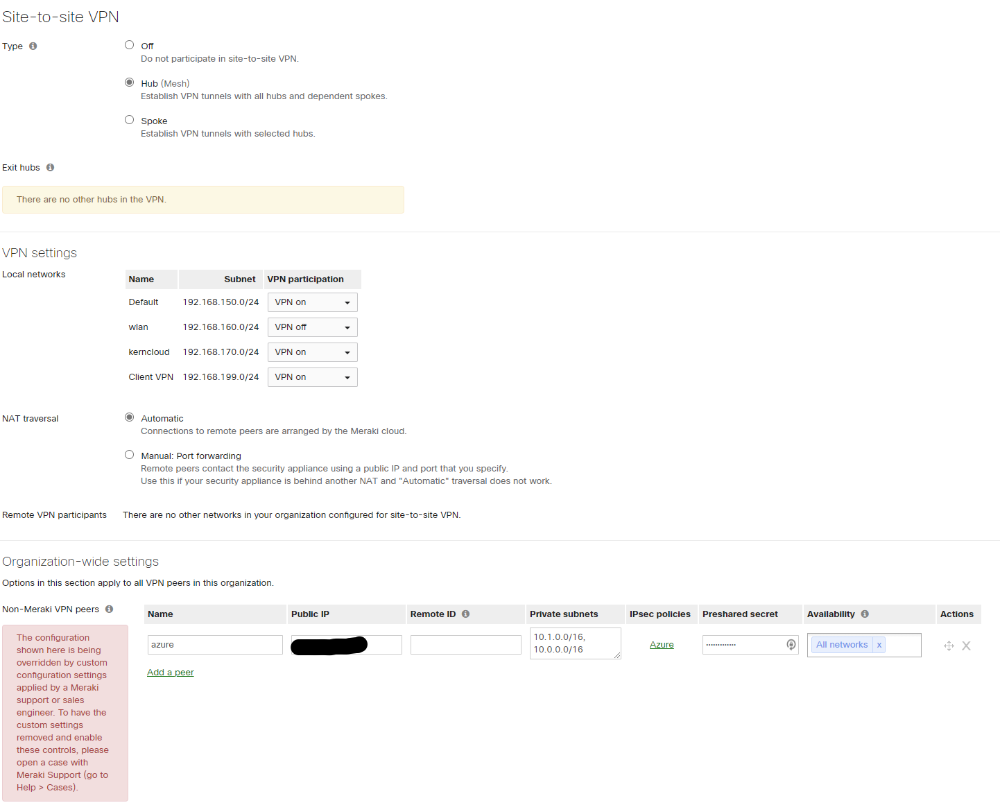
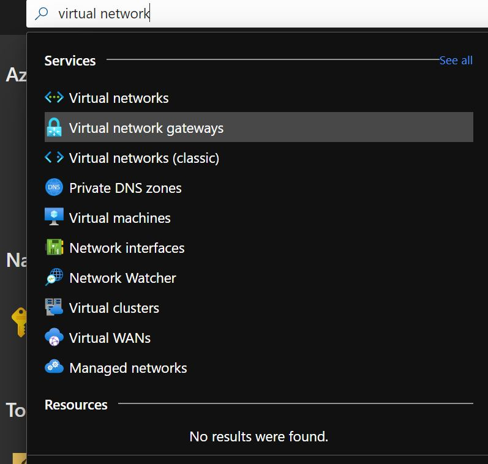
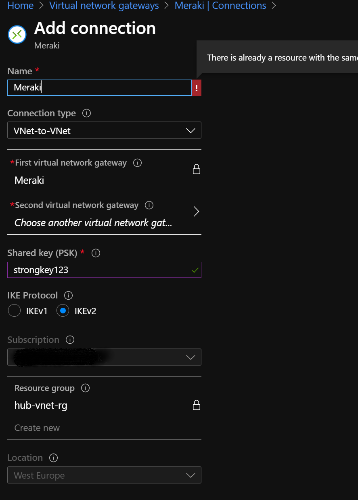

# How to Setup Meraki VPN with Azure

In this post i wanna show how to connect your Meraki Network with Microsoft Azure!

## Meraki Beta Version ##

One of the first things to do is to upgrade the Meraki firmware to version 15.XX. This is because version 15 implements the newer security standard IKEv2.
With this upgrade you get more security and more comfort which comes with using Azure.
Keyword is: route-based vs. policy-based

For this upgrade you need to contact the support over the Help Center.

## Meraki Site

On the Site of Meraki it is really simple.
Go in your "Security & SD-WAN" Settings -> Configure -> Site-to-Site-VPN

    Configure Following Points: 
    Type: Hub(Mesh)

    **VPN Settings**
    Switch your local network which should connect to azure to "VPN ON"

    NAT traversal -> Automatic

    **Organization-wide settings**
    Name: azure
    Public IP: <Virtual Network Gateway Public IP>
    Remote ID: <Empty>
    Private subnets: <your Azure Virtuall networks>
    IPsec Policies: Azure
    Preshared secret: <presharedsecret>
    Availability: <Choose your Meraki Networks>

## Azure Site

### Virtual Network Gateway

### Setup

First create a **Virtual Network Gateway** insite of your Azure portal. Search for "virtuall Network" and check Virtual Network Gateway. In the Setup provide following Information: 

    Subscription: <your-subscription>
    Name: <need to be unique>
    Region: <your prefered Region>
    Gateway type: VPN
    VPN Type: Route-based
    Generation: <Decide with the information from <https://docs.microsoft.com/en-us/azure/vpn-gateway/vpn-gateway-about-vpngateways>.
    Virtual network: <best your hub vnet>

    ## Public IP
    Decide on your envirement, if you have a public ip or create a new one. 

    Enable active-active-mode: <Disable for Testing>
    Configure BGP ASN: <Disable>

    ## Tags can be unused

    After an sucessfull Review and Create, it takes up to 45min until the Gateway is completly setup. 

### Connecton

    Now you need to create a Connection inside your Virtual Network Gateway, to provide it the information of your onPremise Envirement. 

    Go to your Gateway and click **Connection** -> **Add**

    Give your Connection a strong and simple to identify Name and set the Connection Type to **Site-toSite (IPSec)**
    In the Field "virtuel Network Gateway" should be displayed the name of your Gateway. 
    "Local network Gateway" provides now the information of your OnPrem IP-Adress. Click on Create new and set the Public IP Adress from your Meraki Network and the internal IP Adress range, which should be connected with your Azure Network. 

    Shared Key: <presharedsecret> (Same as the <presharedsecret> in your Meraki Settings)
    IKE Protocol: IKEv2 (dont choose IKEv1 because that just work with Merakis older Versions and Azure Virtuall Gateway in **Policy-Based** Mode)
    
    Click on **Create** and your done with the Connection part.

## Check Connection

Now wait a little bit and check under Security & SD-WAN -> Monitor -> VPN Status -> Non-Meraki peers if you connection is green and etablished. 
From the Azure Side you can check the connection status under your **Gateway** -> **Connection**

If this is succesful, you can connect to your Azure Network over you S2S VPN.

Well Done and have fun.
