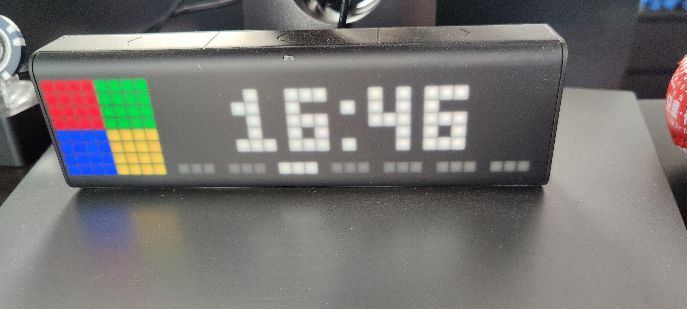

---
layout: post
title:  "Protect your BreakGlass Accounts"
author: Tim
categories: [ AzureAD ]
image: content/lametric.jpg
tags: [AzureAD, BreakGlassAccount]
comments: false
---

# Protect your BreakGlass Account

Beside all security guidelines about how to protect User Accounts and Admin Accounts, there is often an black hole about protecting the company breakglass account(s). 

## Strong password

30+ letters, numbers and special characters
safe one part in a safe and the other part hands on at the Head of IT

## Analyze Sign ins and activity. 

One of the most important task is to get an alert if the breakglass account is in use. Most company have nice concepts and the unterstanding on how to handle their important accounts, but missing an process or system to 

Query Signin 
SigninLogs
| where UserId == "<BreakGlassAccountID>"

Query AuditLogs
Auditlogs
| where UserId == "<BreakGlassAccountID>"
